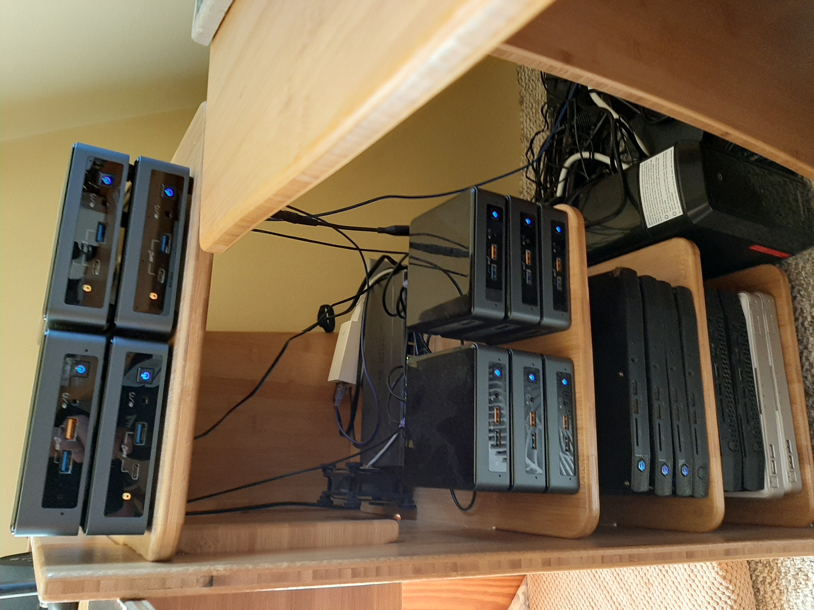
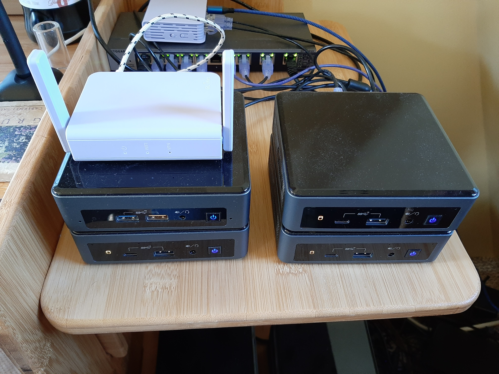

## Building an OpenShift - OKD 4.X Lab, Soup to Nuts

### Equipment for your lab

You will need at least one physical server for your lab.  More is obviously better, but also more expensive.  I have built my lab around the small form-factor NUC systems that Intel builds.  My favorite is the [NUC10i7FNK](https://www.intel.com/content/www/us/en/products/boards-kits/nuc/kits/nuc10i7fnk.html).  This little machine sports a 6-core 10th Gen i7 processor at 25W TDP and supports 64GB of RAM.

I am also a fan of the [NUC10i3FNK](https://www.intel.com/content/www/us/en/products/boards-kits/nuc/kits/nuc10i3fnk.html).  This unit is smaller than the NUC10i7FNK.  It sports a dual-core CPU, supports 64GB of RAM and has a single M.2 slot for an SSD.  One of these will make a great [Bastion Host](pages/Bastion.md) and development server.

You will either need a router that supports DHCP reservations, TFTP, and PXE or you will set up DHCP & TFTP on a Linux host.  Assuming that you already have a home router, you can use that as long as it supports TFTP and PXE configuration.  Most consumer WiFi routers do not support TFTP or PXE.  However, if you want something portable and awesome, check out the GL.iNet [GL-AR750S-Ext](https://www.gl-inet.com/products/gl-ar750s/).  This little guy runs OpenWRT which means that you can use it as a router for your lab network, plus - Wireless bridge, VPN, PXE, Http, DNS, etc...  [OpenWRT](https://openwrt.org) is a very powerful networking distro.  There is a new version out now, [GL-MV1000](https://www.gl-inet.com/products/gl-mv1000/).  It does not have WiFi, but it is much faster than the GL-AR750S-Ext.  I carry the AR750 with me when traveling, and use a pair of the MV1000s in my home lab.

You may also need a network switch, if you don't have enough 1GB ports available in your router.  I am using a couple of [Netgear GS110EMX](https://www.netgear.com/support/product/GS110EMX.aspx).  It's a great little managed switch with 8 1Gb ports and 2 10Gb ports.  The 10Gb ports are really handy if you also have a NAS device that supports 10Gb network speeds.  

Optional: NAS device.

In early 2019, I came across this little Frankenstein.  The QNAP NAS-Book [TBS-453DX](https://www.qnap.com/en-us/product/tbs-453dx).  This thing is not much bigger than the NUCi7KYK, (the VHS tape).  It has 4 M.2 slots for SSD storage and will serve as an iSCSI server, in addition to all of the other capabilities that QNAP markets it for.  The iSCSI server is what caught my eye!  This thing completes a mini-datacenter setup.  With this device added to my lab, I am able to replicate most of the capabilities that you will find in an enterprise datacenter.

My home lab has grown to be almost embarrassing...  but, what can I say, except that I have a VERY understanding wife.

For your own lab, I would recommend starting with the following:

* 1 x NUC8i3BEK - For your Bastion host and development server
    * 32GB RAM
    * 500GB M.2 SATA SSD
* 1 x NUC10i7FNK - For your Hypervisor
    * 64GB RAM
    * 1TB M.2 SATA SSD
* 1 x GL.iNet GL-AR750S-Ext - For your router

A minimal setup like this will cost a little less than a 13" MacBook Pro with 16GB of RAM.  For that outlay you get 8 CPU cores (16 virtual CPUs), 96GB of RAM, and a really cool travel router!

Check prices at [Amazon.com](https://www.amazon.com) and [B&H Photo Video](https://www.bhphotovideo.com).  I get most of my gear from those two outlets.

Once you have acquired the necessary gear, it's time to start setting it all up.

__Follow each of these guides to get setup:__

1. [Bastion Host](pages/Bastion.md)
1. [DNS Setup](pages/DNS_Config.md)
1. [Nginx Setup & RPM Repo sync](pages/Nginx_Config.md)
1. [PXE Boot with TFTP & DHCP](pages/GL-AR750S-Ext.md)
1. [Sonatype Nexus Setup](pages/Nexus_Config.md)
1. [Build KVM Host/s](pages/Deploy_KVM_Host.md)

When your setup is complete, it's time to deploy your OKD cluster:

[Deploy OKD](pages/DeployOKD.md)

After deployment is complete, here are some things to do with your cluster:

1. [Designate your Master Nodes as Infrastructure Nodes](InfraNodes.md)

    __Do Not do this step if you do not have dedicated `worker` nodes.__

    If you have dedicated worker nodes in addition to three master nodes, then I recommend this step to pin your Ingress Routers to the Master nodes.  If they restart on worker nodes, you will lose Ingress access to your cluster unless you add the worker nodes to your external HA Proxy configuration.  I prefer to use Infrasturcture nodes to run the Ingress routers and a number of other pods.

1. [Set up Htpasswd as an Identity Provider](pages/HtPasswd.md)
1. [Deploy a Ceph cluster for block storage provisioning](pages/Ceph.md)
1. [Create a MariaDB Galera StatefulSet](pages/MariaDB.md)
1. [Updating Your Cluster](UpdateOKD.md)
1. [Tekton pipeline for Quarkus and Spring Boot applications](https://github.com/cgruver/tekton-pipeline-okd4)
1. [Gracefully shut down your cluster](pages/ShuttingDown.md)
