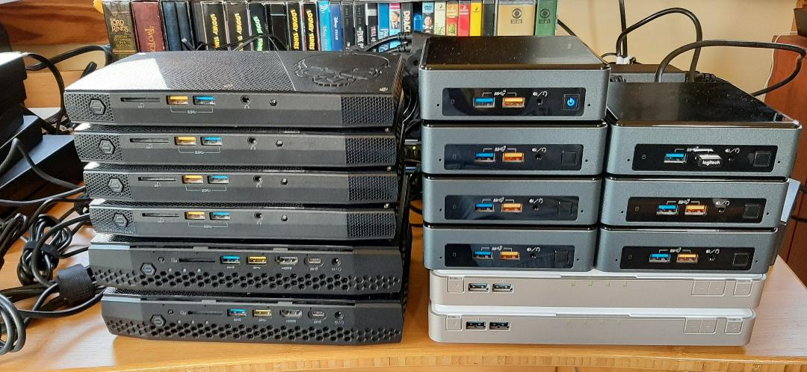
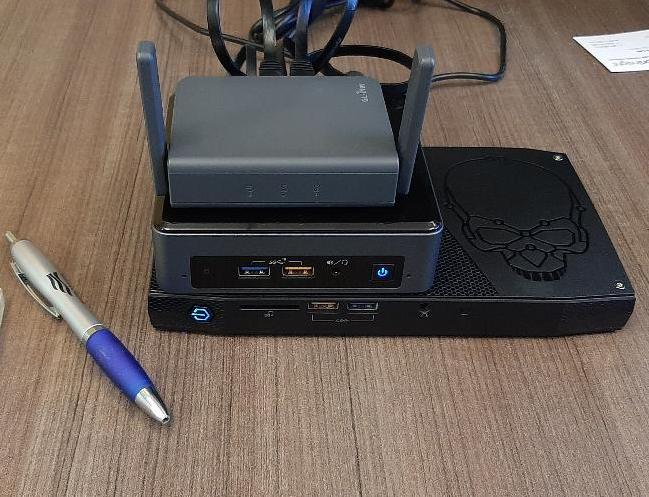

## Building an OpenShift - OKD 4.X Lab, Soup to Nuts

# WIP - This documentation is incomplete.  Check back often.

### Equipment for your lab

You will need at least one physical server for your lab.  More is obviously better, but also more expensive.  I have built my lab around the small form-factor NUC systems that Intel builds.  My favorite is the [NUC6i7KYK](https://ark.intel.com/content/www/us/en/ark/products/89187/intel-nuc-kit-nuc6i7kyk.html).  This little guy is about the size of a VHS video tape, remember those... ;-)

The NUC6i7KYK sports a quad-core 6th Generation i7 processor.  It has 2 M.2 slots for SSD storage and will accept up to 64GB of DDR4 RAM in its 2 SODIMM slots.  It is marketed toward gamers, but makes a very compact and powerful server for your lab.

I don't know if the NUC6i7KYK are still available.  They may have been discontinued now.  However, the newly released [NUC10i7FNK](https://www.intel.com/content/www/us/en/products/boards-kits/nuc/kits/nuc10i7fnk.html) is in the same price range and sports a 6-core processor at 25W TDP vs 45W TDP for the i6KYK.  It also supports 64GB of RAM.  I may begin selling off older units and replacing them with these.

I am also a fan of the [NUC8i3BEK](https://ark.intel.com/content/www/us/en/ark/products/126149/intel-nuc-kit-nuc8i3bek.html).  This unit is smaller than the NUC6i7KYK.  It sports a dual-core CPU, supports 32GB of RAM and has a single M.2 slot for an SSD.  I use one of these for my [Bastion Host](pages/Bastion.md) server.

You will need a router that supports DHCP reservations, TFTP, and PXE.  Assuming that you already have a home router, you can use that as long as it supports TFTP and PXE configuration.  Most consumer WiFi routers do not support TFTP or PXE.  However, if you want something portable and awesome, check out the GL.iNet [GL-AR750S-Ext](https://www.gl-inet.com/products/gl-ar750s/).  This little guy runs OpenWRT which means that you can use it as a router for your lab network, plus - Wireless bridge, VPN, PXE, Http, DNS, etc...  [OpenWRT](https://openwrt.org) is a very powerful networking distro.  There is a new version out now, [GL-MV1000](https://www.gl-inet.com/products/gl-mv1000/).  It does not have WiFi, but it is much faster than the GL-AR750S-Ext.  I carry the AR750 with me when traveling, and use a pair of the MV1000s in my home lab.

__Note: The instructions for this lab setup assume that you are using an OpenWRT router with the `uci` command line interface.  These instructions will work out-of-the-box with the GL.iNet GL-AR750S-Ext or GL-MV1000__

You may also need a network switch, if you don't have enough 1GB ports available in your router.  I am using a couple of [Netgear GS110EMX](https://www.netgear.com/support/product/GS110EMX.aspx).  It's a great little managed switch with 8 1Gb ports and 2 10Gb ports.  The 10Gb ports are really handy if you also have a NAS device that supports 10Gb network speeds.  

Optional: NAS device.

In early 2019, I came across this little Frankenstein.  The QNAP NAS-Book [TBS-453DX](https://www.qnap.com/en-us/product/tbs-453dx).  This thing is not much bigger than the NUCi7KYK, (the VHS tape).  It has 4 M.2 slots for SSD storage and will serve as an iSCSI server, in addition to all of the other capabilities that QNAP markets it for.  The iSCSI server is what caught my eye!  This thing completes a mini-datacenter setup.  With this device added to my lab, I am able to replicate most of the capabilities that you will find in an enterprise datacenter.

My home lab has grown to be almost embarrassing...  but, what can I say, except that I have a VERY understanding wife.

For your own lab, I would recommend starting with the following:

* 1 x NUC8i3BEK - For your Bastion host and development server
    * 32GB RAM
    * 500GB M.2 SATA SSD
* 1 x NUC10i7FNK - For your Hypervisor (I have several NUC6i7KYK, so that is what you see pictured below)
    * 64GB RAM
    * 1TB M.2 SATA SSD
* 1 x GL.iNet GL-AR750S-Ext - For your router

A minimal setup like this will cost a little less than a 13" MacBook Pro with 16GB of RAM.  For that outlay you get 8 CPU cores (16 virtual CPUs), 96GB of RAM, and a really cool travel router!

Check prices at [Amazon.com](https://www.amazon.com) and [B&H Photo Video](https://www.bhphotovideo.com).  I get most of my gear from those two outlets.

Once you have acquired the necessary gear, it's time to start setting it all up.

Follow each of these guides to get setup:

1. [Bastion Host](pages/Bastion.md)
1. [Router Setup](pages/GL-AR750S-Ext.md)
1. [DNS Setup](pages/DNS_Config.md)
1. [Nginx Setup & RPM Repo sync](pages/Nginx_Config.md)
1. [Sonatype Nexus Setup](pages/Nexus_Config.md)
1. [Build additional KVM Host/s](pages/Deploy_KVM_Host.md)

When your setup is complete, it's time to deploy your OKD cluster:

[Deploy OKD](pages/DeployOKD.md)
