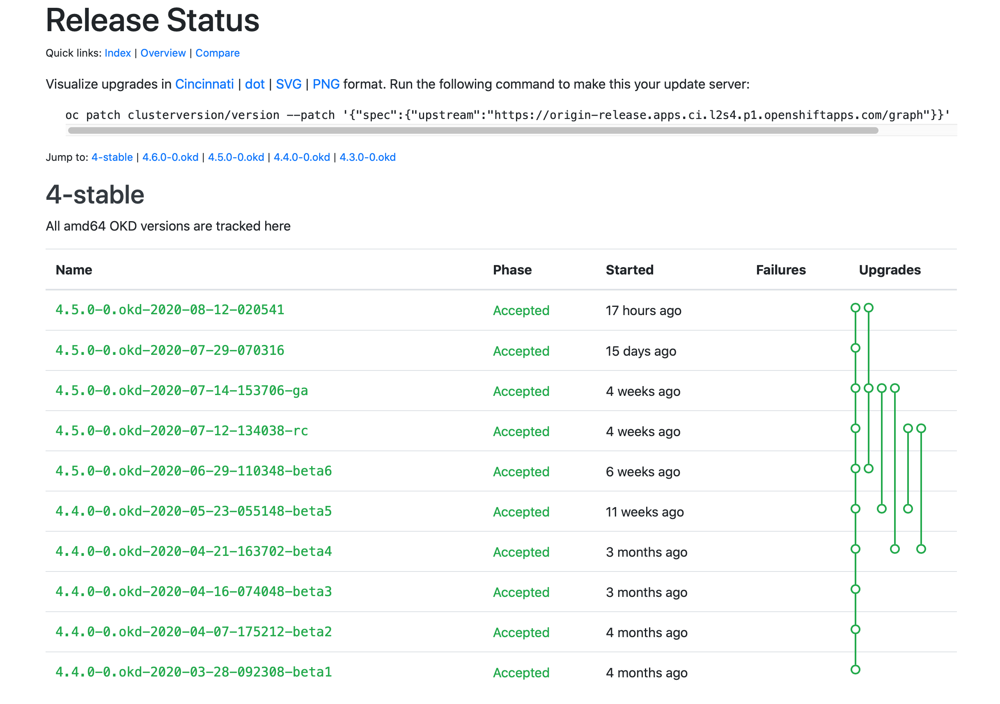

# Documentation is still WIP

## Prepare to Install OKD 4.4

I have provided a set of utility scripts to automate a lot of the tasks associated with deploying and tearing down an OKD cluster.  In your ~/bin/lab-bin directory you will see the following:

| | |
|-|-|
| `DeployLbNode.sh` | Creates a virtual machine that will install and configure HA-Proxy |
| `UnDeployLbNode.sh` | Destroys the load balancer VM and supporting infrastructure |
| `DeployOkdNodes.sh` | Creates the Bootstrap, Master, and Worker VMs from an inventory file, (described below) |
| `UnDeployOkdNodes.sh` | Destroys the OKD cluster and all supporting infrastructure |
| `PowerOnVms.sh` | Helper script that uses IPMI to power on the VMs listed in an inventory file |

1. Deploy the load-balancer:

       DeployLbNode.sh -h=okd4-lb01 -n=bastion -v=6228

    | | | | |
    |-|-|-|-|
    | -h | Sets Hostname: | okd4-lb01 | __*DNS `A` and `PTR` records must exist*__ |
    | -n | Sets the Hypervisor Host | bastion | |
    | -v  | Sets the VBMC Port | 6228 | |

    This will create a VM which will do a kickstart install of CentOS with HA-Proxy.  It will pull the haproxy.cfg file that we prepared earlier when we set up Nginx.  If you are curious about the installation, take a look at: 

    | | |
    |-|-|
    | `${INSTALL_ROOT}/kickstart/lb-node.ks` | The kickstart file that will direct the installation |
    | `${INSTALL_ROOT}/firstboot/lb-node.fb` | The script that will execute on the first boot to install haproxy |
    | `${INSTALL_ROOT}/haproxy.cfg` | The haproxy configuration file for our OKD cluster |

    Let's power it on and watch the installation.

       ipmitool -I lanplus -H10.11.11.10 -p6228 -Uadmin -Ppassword chassis power on
       virsh console okd4-lb01

    You should see your VM do an iPXE boot and begin an unattended installation of CentOS 7.

1. Now let's prepare to deploy the VMs for our OKD cluster by preparing the Cluster VM inventory file:

    This is not an ansible inventory like you might have encountered with OKD 3.11.  This is something I made up for my lab that allows me to quickly create, manage, and destroy virtual machines.

    I have provided an example that will create the virtual machines for this deployment.  It is located at `./Provisioning/guest_inventory/okd4_lab`.  The file is structured in such a way that it can be parsed by the utility scripts provided in this project.  The columns in the comma delimited file are used for the following purposes:

    | Column | Name | Description |
    |-|-|-|
    | 1 | KVM_HOST_NODE  | The hypervisor host that this VM will be provisioned on |
    | 2 | GUEST_HOSTNAME | The hostname of this VM, must be in DNS with `A` and `PTR` records |
    | 3 | MEMORY | The amount of RAM in MB to allocate to this VM |
    | 4 | CPU | The number of vCPUs to allocate to this VM |
    | 5 | ROOT_VOL | The size in GB of the first HDD to provision |
    | 6 | DATA_VOL | The size in GB of the second HDD to provision; `0` for none |
    | 7 | NUM_OF_NICS | The number of NICs to provision for thie VM; `1` or `2` |
    | 8 | ROLE | The OKD role that this VM will play: `BOOSTRAP`, `MASTER`, or `WORKER` |
    | 9 | VBMC_PORT | The port that VBMC will bind to for IPMI control of this VM |

    It looks like this: (The entries for the three worker nodes are commented out, if you have two KVM hosts with 64GB RAM each, then you can uncomment those lines and have a full 6-node cluster)

       bastion,okd4-bootstrap,16384,4,50,0,1,BOOTSTRAP,6229
       kvm-host01,okd4-master-0,20480,4,100,0,1,MASTER,6230
       kvm-host01,okd4-master-1,20480,4,100,0,1,MASTER,6231
       kvm-host01,okd4-master-2,20480,4,100,0,1,MASTER,6232
       # kvm-host02,okd4-worker-0,20480,4,100,0,1,WORKER,6233
       # kvm-host02,okd4-worker-1,20480,4,100,0,1,WORKER,6234
       # kvm-host02,okd4-worker-2,20480,4,100,0,1,WORKER,6235

    Copy this file into place, and modify it if necessary:

       mkdir -p ${OKD4_LAB_PATH}/guest-inventory
       cp ./Provisioning/guest_inventory/okd4_lab ${OKD4_LAB_PATH}/guest-inventory

1. Retrieve the `oc` command.  We're going to grab an older version of `oc`, but that's OK.  We just need it to retrieve to current versions of `oc` and `openshift-install`

    Go to: `https://github.com/openshift/okd/releases/tag/4.4.0-0.okd-2020-01-28-022517` and retrieve the `openshift-client-linux-4.4.0-0.okd-2020-01-28-022517.tar.gz` archive.

       wget https://github.com/openshift/okd/releases/download/4.4.0-0.okd-2020-01-28-022517/openshift-client-linux-4.4.0-0.okd-2020-01-28-022517.tar.gz

1. Uncompress the archive and move the `oc` executable to your ~/bin directory.  Make sure ~/bin is in your path.

       tar -xzf openshift-client-linux-4.4.0-0.okd-2020-01-28-022517.tar.gz
       mv oc ~/bin

    The `DeployOkdNodes.sh` script will pull the correct version of `oc` and `openshift-install` when we run it.  It will over-write older versions in `~/bin`.

1. Now, we need a couple of pull secrets.  

   The first one is for quay.io.  If you don't already have an account, go to `https://quay.io/` and create a free account.

   Once you have your account, you need to extract your pull secret.

   1. Log into your new Quay.io account.
   1. In the top left corner, click the down arrow next to your user name.  This will expand a menu
   1. Select `Account Settings`
   1. Under `Docker CLI Password`, click on `Generate Encrypted Password`
   1. Type in your quay.io password
   1. Select `Kubernetes Secret`
   1. Select `View <your-userid>-secret.yml`
   1. Copy the base64 encoded string under `.dockerconfigjson`

        It will look something like:

           ewoblahblahblahblahblahblahblahREDACTEDetc...IH0KfQ==

        But much longer...
    1. We need to put the pull secret into a JSON file that we will use to mirror the OKD images into our Nexus registry.  We'll also need the pull secret for our cluster install.

       echo "PASTE THE COPIED BASE64 STRING HERE" | base64 -d > ${OKD4_LAB_PATH}/pull_secret.json 

    So, that's the first pull secret.  The second is for our local Nexus install.  We need to push the mirrored images into our Nexus.

    1. Create the pull secret for Nexus

           echo "admin:password" | base64... WIP 

# WIP from here on down...

1. Create the cluster virtual machines and set up for OKD installation:

    We need to pull a current version of OKD.  So point your browser at `https://origin-release.svc.ci.openshift.org`.  

    

    Select the most recent 4.4.0-0.okd release that is in a Phase of `Accepted`, and copy the release name into an environment variable:

       export OKD_RELEASE=4.4.0-0.okd-2020-03-23-073327

    Now, deploy the VMs for the lab cluster:

       DeployOkdNodes.sh -i=/root/okd4-lab/guest-inventory/okd4 -p -m

       oc adm -a ${LOCAL_SECRET_JSON} release mirror --from=registry.svc.ci.openshift.org/${PRODUCT_REPO}/${RELEASE_NAME}:${OKD_RELEASE} --to=${LOCAL_REGISTRY}/${LOCAL_REPOSITORY} --to-release-image=${LOCAL_REGISTRY}/${LOCAL_REPOSITORY}:${OKD_RELEASE}

### Start the LB

    ipmitool -I lanplus -H10.11.11.10 -p6228 -Uadmin -Ppassword chassis power on

### Start the bootstrap node

    ipmitool -I lanplus -H10.11.11.10 -p6229 -Uadmin -Ppassword chassis power on

### Start the cluster master nodes

    for i in 6230 6231 6232
    do
      ipmitool -I lanplus -H10.11.11.10 -p${i} -Uadmin -Ppassword chassis power on
    done

#### Start the cluster worker nodes

    for i in 6233 6234 6235
    do
      ipmitool -I lanplus -H10.11.11.10 -p${i} -Uadmin -Ppassword chassis power on
    done

## Monitor install:

    ssh -o StrictHostKeyChecking=no -o UserKnownHostsFile=/dev/null core@okd4-bootstrap "journalctl -b -f -u bootkube.service"
    ssh -o StrictHostKeyChecking=no -o UserKnownHostsFile=/dev/null core@okd4-master-0 "journalctl -b -f -u kubelet.service"

    openshift-install --dir=${OKD4_LAB_PATH}/okd4-install-dir wait-for bootstrap-complete --log-level debug

    openshift-install --dir=${OKD4_LAB_PATH}/okd4-install-dir wait-for install-complete --log-level debug

    export KUBECONFIG="${OKD4_LAB_PATH}/okd4-install-dir/auth/kubeconfig"

### Approve certs:

    oc get csr

    oc get csr -ojson | jq -r '.items[] | select(.status == {} ) | .metadata.name' | xargs oc adm certificate approve

### Empty vol for registry storage:

    oc patch configs.imageregistry.operator.openshift.io cluster --type merge --patch '{"spec":{"managementState":"Managed","storage":{"emptyDir":{}}}}'

### If it all goes pancake shaped:

    openshift-install --dir=okd4-install gather bootstrap --bootstrap 10.11.11.99 --master 10.11.11.101
