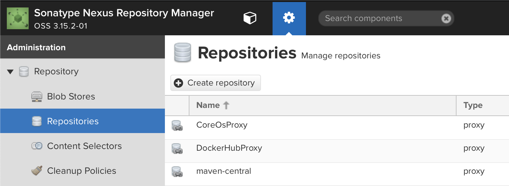
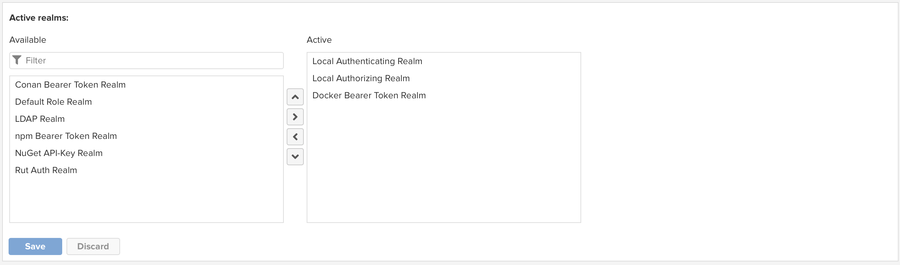

## Setting up Sonatype Nexus

We are now going to install [Sonatype Nexus](https://www.sonatype.com/nexus-repository-oss).  The Nexus will be used for our external container registry, as well as serving as an artifact repository for maven, npm, or any other application development repositories that you might need.

Nexus requires Java 8, so let's install that now if it was not installed during the initial system build:

    dnf -y install java-11-openjdk java-1.8.0-openjdk
    alternatives --set java $(alternatives --display java | grep 'family java-11-openjdk' | cut -d' ' -f1)

Note that we installed both Java 8 and 11, and then set the system to Java 11.  We will configure Nexus to use Java 8, since it does not yet support any newer Java version.

Now, we'll install Nexus:

    mkdir /usr/local/nexus
    cd /usr/local/nexus
    wget https://download.sonatype.com/nexus/3/latest-unix.tar.gz
    tar -xzvf latest-unix.tar.gz
    ln -s nexus-3.14.0-04 nexus-3  # substitute the appropriate version here

Add a user for Nexus:

    groupadd nexus
    useradd -g nexus nexus
    chown -R nexus:nexus /usr/local/nexus

Enable firewall access:

    firewall-cmd --add-port=8081/tcp --permanent
    firewall-cmd --add-port=8443/tcp --permanent
    firewall-cmd --add-port=5000/tcp --permanent
    firewall-cmd --add-port=5001/tcp --permanent
    firewall-cmd --reload

Create a service reference for Nexus so the OS can start and stop it:

    cat <<EOF > /etc/systemd/system/nexus.service
    [Unit]
    Description=nexus service
    After=network.target

    [Service]
    Type=forking
    LimitNOFILE=65536
    ExecStart=/usr/local/nexus/nexus-3/bin/nexus start
    ExecStop=/usr/local/nexus/nexus-3/bin/nexus stop
    User=nexus
    Restart=on-abort
    
    [Install]
    WantedBy=multi-user.target
    EOF

Configure Nexus to use JRE 8

    sed -i "s|# INSTALL4J_JAVA_HOME_OVERRIDE=|INSTALL4J_JAVA_HOME_OVERRIDE=$(alternatives --display java | grep 'slave jre:' | grep 'java-1.8.0-openjdk' | cut -d' ' -f4)|g" /usr/local/nexus/nexus-3/bin/nexus

### Enabling TLS

Before we start Nexus, let's go ahead a set up TLS so that our connections are secure from prying eyes.

```bash
keytool -genkeypair -keystore keystore.jks -storepass password -keypass password -alias jetty -keyalg RSA -keysize 4096 -validity 5000 -dname "CN=nexus.${LAB_DOMAIN}, OU=okd4-lab, O=okd4-lab, L=Roanoke, ST=Virginia, C=US" -ext "SAN=DNS:nexus.${LAB_DOMAIN},IP:${BASTION_HOST}" -ext "BC=ca:true"
cp keystore.jks /usr/local/nexus/nexus-3/etc/ssl/keystore.jks
chown nexus:nexus /usr/local/nexus/nexus-3/etc/ssl/keystore.jks
```

Modify the Nexus configuration for HTTPS:

```bash
mkdir /usr/local/nexus/sonatype-work/nexus3/etc
cat <<EOF >> /usr/local/nexus/sonatype-work/nexus3/etc/nexus.properties
nexus-args=\${jetty.etc}/jetty.xml,\${jetty.etc}/jetty-https.xml,\${jetty.etc}/jetty-requestlog.xml
application-port-ssl=8443
EOF
chown -R nexus:nexus /usr/local/nexus/sonatype-work/nexus3/etc
```

Now we should be able to start Nexus:

```bash
systemctl enable nexus --now
```

Add the Nexus cert to your host's local keystore:

```bash
keytool -printcert -sslserver nexus.${LAB_DOMAIN}:8443 -rfc > /etc/pki/ca-trust/source/anchors/nexus.crt
update-ca-trust
```

Now point your browser to `https://nexus.your.domain.com:8443`.  Login, and create a password for your admin user.

If prompted to allow anonymous access, select to allow.

The `?` in the top right hand corner of the Nexus screen will take you to their documentation.

We need to create a hosted Docker registry to hold the mirror of the OKD images that we will use to install our cluster.

1. Login as your new admin user
1. Select the gear icon from the top bar, in between a cube icon and the search dialog.
1. Select `Repositories` from the left menu bar.

    

1. Select `+ Create repository`
1. Select `docker (hosted)`
1. Name your repository `origin`
1. Check `HTTPS` and put `5001` in the port dialog entry
1. Check `Allow anonymous docker pull`
1. Check `Enable Docker V1 API`, you may need this for some older docker clients.

    

1. Click `Create repository` at the bottom of the page.
1. Now expand the `Security` menu on the left and select `Realms`
1. Add `Docker Bearer Token Realm` to the list of active `Realms`

    

1. Click `Save`

Now we need to deploy at least one KVM host for our cluster: [Build KVM Host/s](Deploy_KVM_Host.md)
