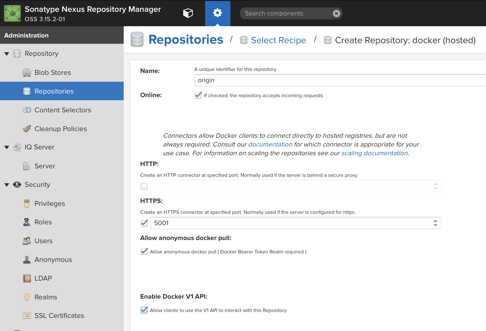

## Setting up Sonatype Nexus

We are now going to install [Sonatype Nexus](https://www.sonatype.com/nexus-repository-oss).  The Nexus will be used for our external container registry, as well as serving as an artifact repository for maven, npm, or any other application development repositories that you might need.

Nexus requires Java, so let's install that now if it was not installed during the initial system build:

    yum -y install java-1.8.0-openjdk.x86_64

Now, we'll install Nexus:

    mkdir /usr/local/nexus
    cd /usr/local/nexus
    wget https://download.sonatype.com/nexus/3/latest-unix.tar.gz
    tar -xzvf latest-unix.tar.gz
    ln -s nexus-3.14.0-04 nexus-3  # substitute the appropriate version here

Add a user for Nexus:

    groupadd nexus
    useradd -g nexus nexus
    chown -R nexus:nexus /usr/local/nexus

Enable firewall access:

    firewall-cmd --add-port=8081/tcp --permanent
    firewall-cmd --add-port=8443/tcp --permanent
    firewall-cmd --add-port=5000/tcp --permanent
    firewall-cmd --add-port=5001/tcp --permanent
    firewall-cmd --reload

Create a service reference for Nexus so the OS can start and stop it:

    cat <<EOF > /etc/systemd/system/nexus.service
    [Unit]
    Description=nexus service
    After=network.target

    [Service]
    Type=forking
    LimitNOFILE=65536
    ExecStart=/usr/local/nexus/nexus-3/bin/nexus start
    ExecStop=/usr/local/nexus/nexus-3/bin/nexus stop
    User=nexus
    Restart=on-abort
    
    [Install]
    WantedBy=multi-user.target
    EOF

Now, we will enable Nexus to auto-start at boot, but not start it yet:

    systemctl enable nexus

### Enabling TLS

Before we start Nexus, let's go ahead a set up TLS so that our connections are secure from prying eyes.

1. Generate a Java Key Store.

       openssl req -newkey rsa:4096 -nodes -sha256 -keyout nexus.key -x509 -days 5000 -out nexus.crt

        # Country Name (2 letter code) [XX]:US
        # State or Province Name (full name) []:Virginia
        # Locality Name (eg, city) [Default City]:Roanoke
        # Organization Name (eg, company) [Default Company Ltd]:yourCom
        # Organizational Unit Name (eg, section) []:okd4-lab
        # Common Name (eg, your name or your server's hostname) []:nexus.your.domain.org
        # Email Address []:

    Now create the key.  Use `password` for the password.

        openssl pkcs12 -export -in nexus.crt -inkey nexus.key -name "${LAB_DOMAIN}" -out nexus.p12
        keytool -importkeystore -deststorepass password -destkeystore keystore.jks -srckeystore nexus.p12 -srcstoretype PKCS12
        keytool -importkeystore -srckeystore keystore.jks -destkeystore keystore.jks -deststoretype pkcs12

        cp keystore.jks /usr/local/nexus/nexus-3/etc/ssl/keystore.jks
        chown nexus:nexus /usr/local/nexus/nexus-3/etc/ssl/keystore.jks
        cp nexus.crt /etc/pki/ca-trust/source/anchors/nexus.crt
        update-ca-trust

1. Modify the Nexus configuration for HTTPS:

       mkdir /usr/local/nexus/sonatype-work/nexus3/etc
       cat <<EOF >> /usr/local/nexus/sonatype-work/nexus3/etc/nexus.properties
       nexus-args=\${jetty.etc}/jetty.xml,\${jetty.etc}/jetty-https.xml,\${jetty.etc}/jetty-requestlog.xml
       application-port-ssl=8443
       EOF
       chown -R nexus:nexus /usr/local/nexus/sonatype-work/nexus3/etc

Now we should be able to start Nexus and connect to it with a browser:

    systemctl start nexus

Now point your browser to `https://nexus.your.domain.com:8443`.  Login, and create a password for your admin user.

If prompted to allow anonymous access, select to allow.

The `?` in the top right hand corner of the Nexus screen will take you to their documentation.

We need to create a hosted Docker registry to hold the mirror of the OKD images that we will use to install our cluster.

1. Login as your new admin user
1. Select the gear icon from the top bar, in between a cube icon and the search dialog.
1. Select `Repositories` from the left menu bar.

    

1. Select `+ Create repository`
1. Select `docker (hosted)`
1. Name your repository `origin`
1. Check `HTTPS` and put `5001` in the port dialog entry
1. Check `Allow anonymous docker pull`
1. Check `Enable Docker V1 API`, you may need this for some older docker clients.

    

1. Click `Create repository` at the bottom of the page.

Now we need to deploy at least one KVM host for our cluster: [Build KVM Host/s](Deploy_KVM_Host.md)
