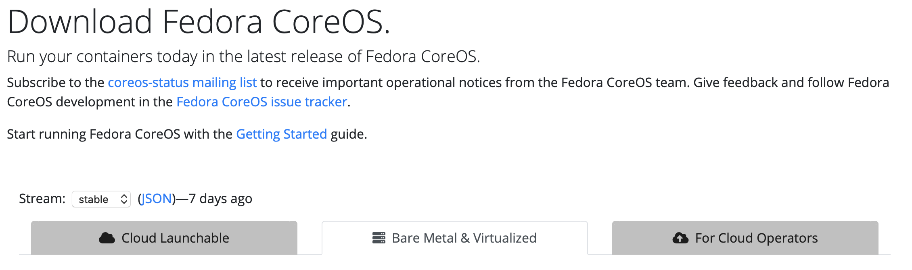

## Nginx Config & RPM Repository Synch
We are going to install the Nginx HTTP server and configure it to serve up all of the RPM packages that we need to build our guest VMs.

We'll use the reposync command to copy RPM repository contents from remote mirrors into our Nginx server.

We are also going to copy the CentOS minimal install ISO into our Nginx server. 

We need to open firewall ports for HTTP/S so that we can access our Nginx server:

    firewall-cmd --permanent --add-service=http
    firewall-cmd --permanent --add-service=https
    firewall-cmd --reload

Install and start Nginx:

    dnf -y install nginx
    systemctl enable nginx --now

### RPM Repository Mirror

Create directories to hold all of the RPMs:

    mkdir -p ${REPO_PATH}/{baseos,appstream,extras,epel-modular,epel,powertools}

Synch the repositories into the directories we just created:  (This will take a while)

    LOCAL_REPOS="baseos appstream extras epel epel-modular powertools"
    for REPO in ${LOCAL_REPOS}
    do
        reposync -m --repoid=${REPO} --newest-only --delete --download-metadata -p ${REPO_PATH}/  
    done

Our Nginx server is now ready to serve up CentOS RPMs.

To refresh your RPM repositories, run the above script again, or better yet, create a cron job to run it periodically.

### Host installation, FCOS & CentOS

Now, we are going to set up the artifacts for host installation.  This will include FCOS via `ignition`, and CentOS via `kickstart`.

    mkdir -p ${INSTALL_ROOT}/{centos,fcos,fcos/ignition,firstboot,kickstart,hostconfig,postinstall}

Create encrypted passwords to be used in your KVM host and Guest installations:

    mkdir -p ${OKD4_LAB_PATH}
    openssl passwd -1 'guest-root-password' > ${OKD4_LAB_PATH}/lab_guest_pw
    openssl passwd -1 'host-root-password' > ${OKD4_LAB_PATH}/lab_host_pw

### CentOS:

1. Deploy the Minimal ISO files.

    Download the CentOS Stream install files from a mirror:

       wget -m -np -nH --cut-dirs=5 -P ${INSTALL_ROOT}/centos http://mirror.centos.org/centos/8-stream/BaseOS/x86_64/os/

1. Deploy the files from this project for supporting `kickstart` installation.

    Make a temporary work space:

       mkdir tmp-work

    Prep the install files from this project:

       cp -rf ./Provisioning/guest_install/postinstall ./tmp-work

       sed -i "s|%%REPO_URL%%|${REPO_URL}|g" ./tmp-work/postinstall/local-repos.repo
       sed -i "s|%%LAB_NAMESERVER%%|${LAB_NAMESERVER}|g" ./tmp-work/postinstall/chrony.conf

    Copy your public SSH key

       cat ~/.ssh/id_rsa.pub > ./tmp-work/postinstall/authorized_keys

    Copy the prepared files into place
    
       scp -r ./tmp-work/postinstall root@${INSTALL_HOST}:${INSTALL_ROOT}
       rm -rf ./tmp-work

### FCOS:

1. In a browser, go to: `https://getfedora.org/en/coreos/download/`
1. Make sure you are on the `stable` Stream, select the `Bare Metal & Virtualized` tab, and make note of the current version. 

    

1. Set the FCOS version as a variable.  For example:

       FCOS_VER=32.20200923.3.0

1. Set the FCOS_STREAM variable to `stable` or `testing` to match the stream that you are pulling from.

       FCOS_STREAM=stable

1. Download the FCOS images for iPXE booting:

       mkdir /tmp/fcos
       curl -o /tmp/fcos/vmlinuz https://builds.coreos.fedoraproject.org/prod/streams/${FCOS_STREAM}/builds/${FCOS_VER}/x86_64/fedora-coreos-${FCOS_VER}-live-kernel-x86_64
       curl -o /tmp/fcos/initrd https://builds.coreos.fedoraproject.org/prod/streams/${FCOS_STREAM}/builds/${FCOS_VER}/x86_64/fedora-coreos-${FCOS_VER}-live-initramfs.x86_64.img
       curl -o /tmp/fcos/rootfs.img https://builds.coreos.fedoraproject.org/prod/streams/${FCOS_STREAM}/builds/${FCOS_VER}/x86_64/fedora-coreos-${FCOS_VER}-live-rootfs.x86_64.img
       scp -r /tmp/fcos root@${INSTALL_HOST}:${INSTALL_ROOT}
       rm -rf /tmp/fcos

Now, continue on to [DHCP Setup](GL-AR750S-Ext.md)
